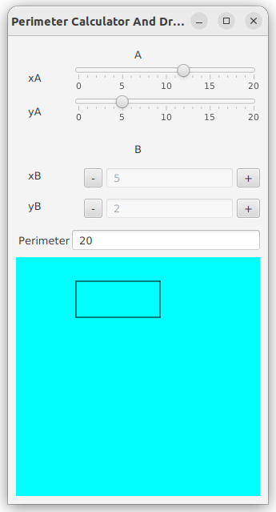

# 

# Développement d'applications avec IHM

### IUT Montpellier-Sète – Département Informatique

* [**Support de cours**](https://gitlabinfo.iutmontp.univ-montp2.fr/ihm/ressources)
* **Enseignants:**
    * [Sophie Nabitz](mailto:sophie.nabitz@univ-avignon.fr),
      [Cyrille Nadal](mailto:cyrille.nadal@umontpellier.fr),
      [Nathalie Palleja](mailto:nathalie.palleja@umontpellier.fr),
      [Xavier Palleja](mailto:xavier.palleja@umontpellier.fr),
      [Zouhaira Ayadi](mailto:zouhaira.ayadi@umontpellier.fr),
      [Petru Valicov](mailto:petru.valicov@umontpellier.fr)
* Le [forum Piazza](https://piazza.com/class/lusd3gv57i85y1/) de ce cours pour poser vos questions
* [Email](mailto:petru.valicov@umontpellier.fr) pour une question d'ordre privée concernant le cours.

## TP 3 : gestionnaires d'événement et propriétés
##### Sujet inspiré de l'examen à l'IUT d'Aix-Marseille Université en 2021

### Exercice 1 - Un peu d'arithmétique

On s'intéresse à un petit programme qui permet d'afficher des problèmes arithmétiques et qui affiche combien de réponses sont justes. Voici une présentation de l'application en deux étapes :
Étape 1 :

Étape 2 :

Le contrôle que vous aurez à utiliser est
un [ComboBox](https://openjfx.io/javadoc/20/javafx.controls/javafx/scene/control/ComboBox.html), qui permet de choisir
le nombre d'exercices à afficher. Veuillez regarder la documentation de cette classe pour savoir comment l'utiliser
avant de poursuivre.

Notamment, notez l'utilisation de la
propriété [valueProperty](https://openjfx.io/javadoc/20/javafx.controls/javafx/scene/control/ComboBoxBase.html#valueProperty())
et [selectedItemProperty](https://openjfx.io/javadoc/20/javafx.controls/javafx/scene/control/SelectionModel.html#selectedItemProperty()),
qui permet de savoir quelle est la valeur actuelle de la ComboBox. Quand un item est sélectionné, la propriété est mise
à jour pour représenter l'item sélectionné.

1. Complétez la méthode `start()` de la classe `AppMaths` et créez une fenêtre rassemblant à celle de l'étape 1 pour que
   la `ComboBox` affiche 6, 9, 12 et 15 comme choix possibles.
2. Complétez la classe `LigneExercice`afin qu'elle modélise chacune des lignes d'exercices (image de l'étape 2). Notez que parmi les attributs de cette classe, il y a un objet de type `Exercice`.
3. Modifiez le code de la classe `AppMaths` afin de prendre en compte le choix de l'utilisateur et mettre à jour la fenêtre de façon à ce qu'elle ressemble à celle de l'étape 2. Pour mettre à jour dynamiquement les exercices affichés en fonction du choix de l'utilisateur, on vous propose de suivre le processus suivant :
    * Ajouter un `ChangeListener` sur `valueProperty` de votre `ComboBox` afin que la méthode `changed()` de cet écouteur fasse le changement nécessaire
    * Dans la méthode `changed()`, vous devrez :
        * créer le nombre nécessaire de lignes d'exercices et les ajouter dans un conteneur `VBox` (pensez à nettoyer au préalable les exercices qui seraient déjà dans la liste...).
        * ajouter dans le même conteneur un bouton de validation des résultats qui, pour moment, ne fera rien.
        * pensez à ajuster la taille de la fenêtre pour que tous les éléments de votre conteneur contenant les exercices soient visibles. Vous pouvez utiliser l'instruction suivante :
          `votreContaineur.getScene().getWindow().sizeToScene();`

4. La classe `Exercice` vous est partiellement donnée. Elle génère un exercice avec son énoncé et sa solution. Ajoutez à cette classe une propriété `IntegerProperty solution` qui encapsulera la solution à l'énoncé. Ajoutez un _getter_ sur cette propriété.

5. Ajoutez une propriété `BooleanProperty correct` à la classe `LigneExercice`. Cette propriété devra permettre de savoir si la réponse fournie est correcte (c'est-à-dire correspond à la solution de l'exercice).

6. Ajoutez dans la classe principale `AppMaths` un gestionnaire d'événement sur le bouton de validation. Il devra afficher une nouvelle fenêtre indiquant le nombre de réponses correctes. Pour cela, vous utiliserez la classe [Alert](https://openjfx.io/javadoc/20/javafx.controls/javafx/scene/control/Alert.html) de JavaFX. La fonction `showAndWait()` vous permettra de rendre la fenêtre bloquante : tant que l'utilisateur n'a pas validé, il ne pourra pas revenir sur la fenêtre principale.

7. Dans votre version actuelle, lorsqu'un utilisateur choisit un nombre d'exercices, l'intégralité de la liste des exercices est régénérée. Modifiez le code de façon à ce qu'un maximum des exercices incorrectement répondus soit régénéré d'abord avant de générer les nouveaux (si le nombre d'exercices incorrects est supérieur au choix `n` de la `ComboBox`, on affichera les `n` premiers exercices incorrects).

### Exercice 2 - Un peu de géométrie

On s'intéresse à un petit programme qui permet de dessiner des rectangles et qui devra rassembler à l'image ci-dessous.

Cette application dessine un rectangle dans le panneau de couleur de fond bleu cyan et affiche le périmètre de ce rectangle dans le composant `TextField` correspondant.

Le rectangle est défini par 2 points **A** et **B**, sommets opposés, donc symétriques par rapport au centre.

Les 2 Sliders permettent de renseigner les valeurs des coordonnées du point **A**.

Les boutons  et  permettent de modifier les valeurs des coordonnées du point B, coordonnées qui s'afficheront aussi dans le `TextField` (ici non éditable) figurant entre les deux boutons (non éditable).

La classe principale est `RectanglePerimeterCalculatorAndDrawer`. Elle vous est intégralement donnée. À priori, vous n'aurez pas à la modifier.

1. Utilisez l'outil _SceneBuilder_ pour compléter le fichier `fenetrePerimetre.fxml` pour que l'application ressemble à l'image ci-dessus. La fenêtre correspond à une grille et le panneau coloré du bas est déjà donné sous forme de conteneur `Pane`. **Les lignes du rectangle ne doivent pas encore être dessinées.**
2. Définissez dans la classe `Rectangle` quatre attributs `IntegerProperty` `xA`, `yA`, `xB`, `yB`, ainsi qu'une propriété `perimetre` et instanciez-les dans le constructeur. Ajoutez un _getter_ sur chacune de ces propriétés (mais pas de _setter_ sur la valeur).
3. Écrivez le code de la méthode `createBinding()` qui doit :
    * gérer le calcul de la largeur du rectangle
    * gérer le calcul de la hauteur du rectangle
    * définir la liaison du périmètre avec les calculs des largeur et hauteur précédemment définis.

La classe `PanneauPrincipal` représente le contrôleur pour le fichier FXML `fenetrePerimetre.fxml` et son code est à compléter dans les questions qui vont suivre.

4.  Ajoutez quatre attributs de type `Line` qui correspondront aux côtés du rectangle à dessiner et complétez la méthode `addLines()` pour ajouter les 4 segments au panneau bleu du bas de la fenêtre.

5. Écrivez les méthodes `incrementerBx()` et `decrementerBx()` : il s'agit de modifier la valeur des `TextField` correspondants du fichier FXML en tenant des contraintes suivantes : on ne peut pas décrémenter en dessous de 0, ni incrémenter au-dessus de `valeurMaxCoordonnees`. Mettez à jour le fichier FXML pour que le clic sur les boutons  et  invoque ces fonctions.

6. Pour gérer le clic sur les boutons agissant sur l'ordonnée du second point, complétez le contenu des méthodes `setByMinusAction()` et `setByPlusAction()`.

7. Complétez la méthode `bindSommetsRectangle()` : elle devra lier les coordonnées des 2 points **A** et **B** de l'attribut `rectangle` aux contrôles correspondants (les Sliders pour un point et les Buttons pour l'autre).

8. Dans la méthode `bindPerimeterTextField()`, liez la propriété text du `TextField` représentant la valeur du périmètre à la propriété correspondante dans la classe `Rectangle`.

9. Implémentez les méthodes `bindHorizontal1()` et `bindVertical1()`, qui adaptent le tracé de (seulement) 2 segments du rectangle dont une extrémité correspond au point **A** : liez, pour le segment concerné, les propriétés correspondant aux coordonnées de son point de départ (`startX` et `startY`) et de son point d'arrivée (`endX` et `endY`) aux coordonnées correspondantes dans le rectangle. Pour que les segments soient correctement dessinés sur le `Pane` correspondant de la fenêtre, il faudra appliquer un facteur multiplicatif égal à `ratioDessin`.